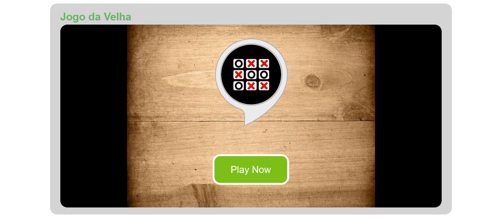
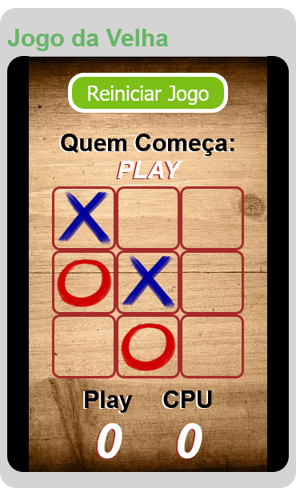

<h1 align='center'>Jogo-da-velha</h1>

<h2>📋 Sobre o projeto</h2>

Projeto criado aparti do desafio do curso cfb curso javascript

 <h2 id="techs"> 💻 Tecnologias</h2>
 
- [HTML]()
- [CSS]()
- [JavaScript]()

<h2>🎨 Layouts</h2>
<h3>Web:</h3>

<h3>Mobile:</h3>

 <h2 id="autor"> 🦸 Autor</h2>

[Rodrigo-Souza-Dev](https://github.com/Rodrigo-Souza-DEV)

<h2 id="licenca"> ⚠️  Licença</h2>

Esse projeto esta sobre a licença [MIT](https://github.com/Rodrigo-Souza-DEV/Jogo-da-velha-/blob/master/LICENSE).

Feito por <a href="https://github.com/Rodrigo-Souza-DEV">Rodrigo Souza.</a>

<h3>Acesse o jogo <a href="https://rodrigo-souza-dev.github.io/Jogo-da-velha-/">Aqui.</a></h3>
